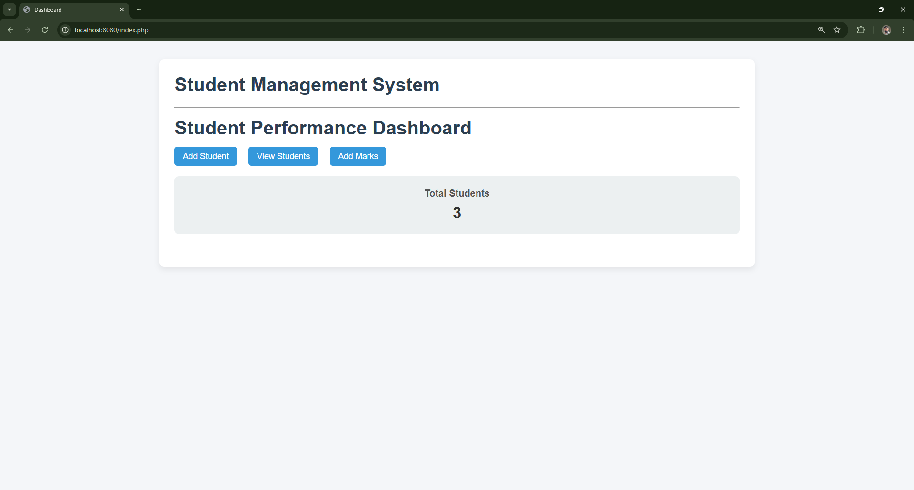
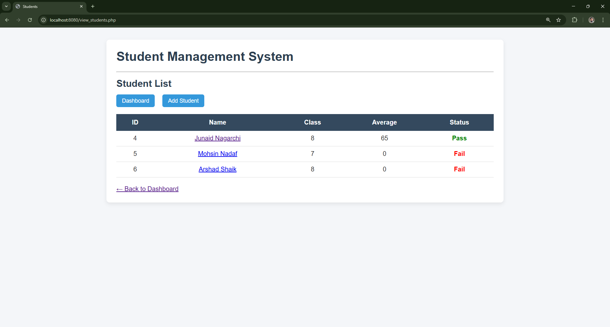
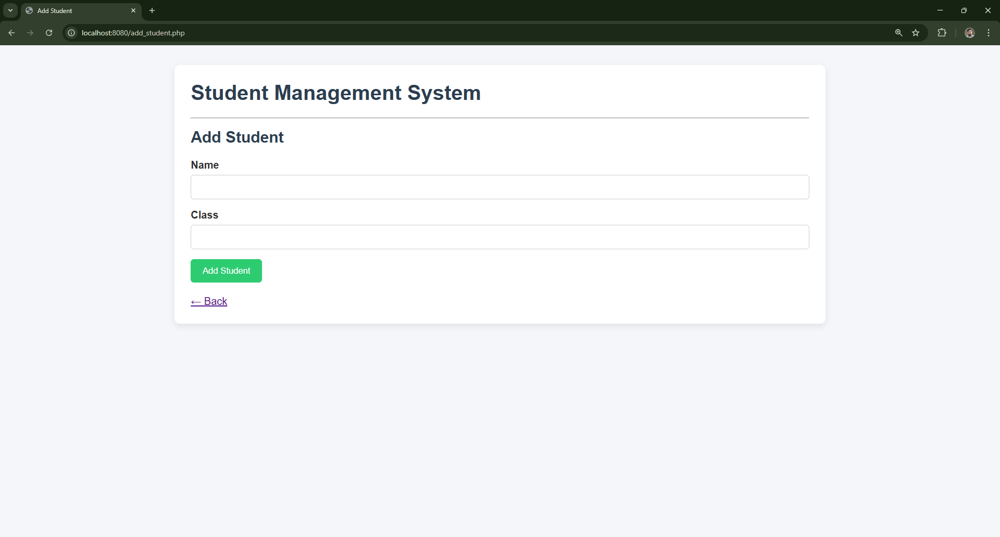

# 🎓 Student Management System

A beginner-friendly **Student Management System** built using **PHP, MySQL, and Docker**.  
The application allows managing student records, tracking subject-wise marks, and analyzing academic performance through a clean and professional web interface.

---

## 📸 Screenshots

### Dashboard


### Student List


### Student Profile


---

## 🚀 Features

- 📋 Add and manage student records  
- 📊 Add subject-wise marks using predefined subjects  
- 👤 View individual student profiles with detailed subject marks  
- 🧮 Automatic average marks calculation  
- ✅ Pass / Fail status based on performance  
- 🗑️ Safe deletion of student records  
- 🐳 Fully containerized using Docker (no XAMPP or local MySQL required)

---

## 🛠️ Tech Stack

- **Frontend:** HTML, CSS  
- **Backend:** PHP  
- **Database:** MySQL  
- **Containerization:** Docker & Docker Compose  

---

## 📁 Project Structure

```text
student-management-system/
│
├── app/
│   ├── index.php
│   ├── view_students.php
│   ├── add_student.php
│   ├── add_marks.php
│   ├── student_profile.php
│   ├── db.php
│   └── style.css
│
├── screenshots/
│   ├── 1.png
│   ├── 2.png
│   └── 3.png
│
├── database.sql
├── Dockerfile
├── docker-compose.yml
└── README.md
